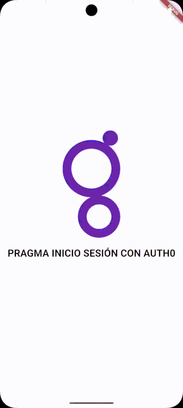

<h1 align="center">
  <br>
  <a href="https://flutter.dev/"></a>
  <br>
  Integración Auth0 Flutter
  <br>
</h1>

<h4 align="center">Proyecto base de integración segura con <a href="https://auth0.com" target="_blank">Auth0</a> usando Flutter.</h4>

<p align="center">
  <a href="https://flutter.dev">
    
  </a>
  <a href="https://auth0.com">
    
  </a>
  <a href="https://dart.dev">
    
  </a>
  <a href="https://bloclibrary.dev">
    
  </a>
  <a href="https://pub.dev">
    
  </a>
</p>

Redacta aquí una breve descripción del proyecto...

<p align="center">
  <a href="#topicos">Tópicos</a> •
  <a href="#tecnologias">Tecnologías</a> •
  <a href="#consideraciones">Consideraciones</a> •
  <a href="#descarga">Descarga</a> •
  <a href="#instalacion-y-ejecucion">Instalación y ejecución</a> •
  <a href="#autores">Autores</a> •
  <a href="#relacionados">Relacionados</a> •
  <a href="#roadmap">Roadmap</a>
</p>

<p align="center">
  
</p>

## Tópicos

* Flutter
* Autenticación segura
* BLoC
* Arquitectura modular
* Auth0
* Pruebas unitarias

## Tecnologías

### Este proyecto requiere:

* \[Flutter SDK] versión >=3.4.3
* \[Dart SDK] versión >=3.4.3
* \[Auth0] credenciales de aplicación

## Consideraciones

* Crear un archivo `.env` en la raíz del proyecto con las credenciales de Auth0:

```
AUTH0_DOMAIN=your-domain.auth0.com
AUTH0_CLIENT_ID=your-client-id
```

* Utiliza `flutter_modular` para modularizar la arquitectura del proyecto.
* El idioma principal es el español (soporte para internacionalización).

## Descarga

Para clonar esta aplicación desde la línea de comandos:

```bash
git clone https://github.com/yourusername/auth0.git
cd auth0
git remote remove origin
git remote add origin URL_DE_TU_NUEVO_REPOSITORIO
git push -u origin master
```

## Instalación y ejecución

Instalar dependencias:

```bash
flutter pub get
```

Ejecutar la app:

```bash
flutter run
```

## Estructura del Proyecto

```
lib/
├── core/           # Funcionalidades centrales y utilidades
├── features/       # Módulos basados en funcionalidades
├── shared/         # Widgets y componentes compartidos
└── main.dart       # Punto de entrada de la aplicación
```

## Dependencias

* **Gestión de Estado:**

  * flutter\_bloc: ^8.1.6
  * bloc: ^8.1.4
  * equatable: ^2.0.5

* **Autenticación:**

  * auth0\_flutter: ^1.7.2

* **Componentes de UI:**

  * google\_fonts: ^6.2.1
  * flutter\_svg: ^2.0.10+1
  * lottie: ^3.1.1
  * gap: ^3.0.1

* **Utilidades:**

  * flutter\_dotenv: ^5.1.0
  * connectivity\_plus: ^6.0.3
  * internet\_connection\_checker: ^1.0.0+1
  * oktoast: ^3.4.0

## Testing

Ejecutar pruebas:

```bash
flutter test
```

## Autores

| [<br><sub>Wilver Rojas</sub>](https://github.com/wilver06w) |
|:-------------------------------------------------------------------------------------------------------------------:|

## Relacionados

* [Documentación Auth0 Flutter](https://auth0.com/docs/quickstart/native/flutter)

## Roadmap

* [ ] Soporte para refrescar tokens
* [ ] Integración con APIs seguras
* [ ] Implementar manejo de roles y permisos
